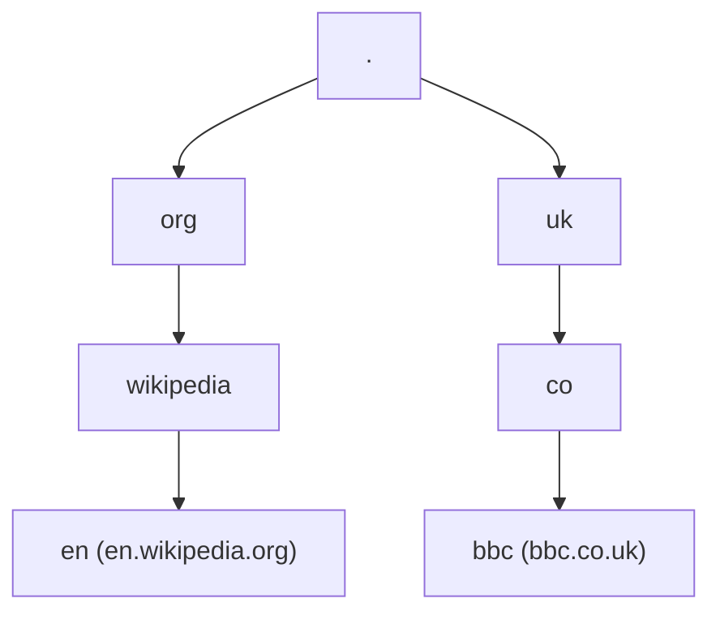

# DNS como banco de dados federado: árvore, zonas e rótulos

Relaciona com a [visão geral](02-o-que-e-dns-visao-geral.md) (zonas e delegações) e com a [introdução](01-introducao-o-que-e-dns.md) (federação).

## Banco de dados federado

Um **banco federado** é um sistema formado por **vários bancos menores** que, juntos, parecem um banco maior.

No DNS, a pergunta natural é: **como o “banco” é fatiado em pedaços menores?**

## Divisão: árvore de nomes

O **espaço de nomes** (todos os nomes de domínio possíveis) é organizado em uma **árvore**. Cada **subárvore** pode ser administrada e servida como um **pedaço independente** do sistema — isso corresponde à ideia de **zonas** e **delegação**.

### Ideia visual (subconjunto da internet)

Todo nome “absoluto” na árvore **começa na raiz** e desce pelos rótulos: por exemplo, `en.wikipedia.org` segue o caminho raiz → `org` → `wikipedia` → `en` (leia a ordem dos rótulos na seção abaixo).

### Todo nó pode ser um nome de domínio válido

Não só as “folhas”: **nós intermediários** também são nomes DNS válidos.

- **`org`**, **`uk`**, etc. são domínios válidos.
- A **zona raiz** (o nó raiz) também é um nome válido no modelo DNS, embora **não** “hospede site” no sentido usual.

**Exemplos práticos:**

- `www.jenny.ai` é válido; muitas vezes **redireciona** para `jenny.ai` (sem `www`).
- O TLD **`ai`** em si pode ser um host com serviços na web (depende do registrador/operador).

## Zonas: agrupamento e delegação

Os nomes são **agrupados em zonas** (pedaços da árvore para os quais um conjunto de servidores é **autoritativo**).

Exemplos conceituais:

| Zona | Conteúdo típico (ideia) |
|------|-------------------------|
| **Raiz** | Apenas o nível raiz e **delegações** para os TLDs. |
| **`org`** | O domínio `org` e delegações (ex.: para `wikipedia.org`). |
| **`wikipedia.org`** | Vários nomes sob esse domínio (`en.wikipedia.org`, etc.). |

### Caso `uk`

A hierarquia sob **`.uk`** é um bom exemplo: existem nomes como **`co.uk`**, **`gov.uk`**, etc. — **alguns** conceitos ficam na **mesma zona**, **outros** são **zonas próprias** com delegação. Isso mostra que a realidade dos ccTLD nem sempre é “uma zona por rótulo”, mas a **delegação recursiva** continua sendo o mecanismo.

### Delegação é recursiva

Da raiz → zona `.uk` → zona `bbc.co.uk` → … o processo **pode continuar** em profundidade (com limites práticos de tamanho de nome, políticas de registro, etc.).

## Notação: rótulos e FQDN

- Cada segmento da árvore é um **rótulo** (*label*). Ex.: `en`, `wikipedia`, `org` são rótulos.
- O rótulo da **raiz** é a **string vazia** `""`.
- Rótulos são **separados por ponto** (`.`).

Ordem na escrita (FQDN — *fully qualified domain name*):

- Do **mais específico** para o **menos específico**, terminando na raiz implícita ou explícita.
- Correto: `en.wikipedia.org` (equivale a “`en` + `.` + `wikipedia` + `.` + `org` + `.` + raiz”).

**Não** se escreve como `org.wikipedia.en`.

### Ponto final (raiz explícita)

O **último ponto** (representando o rótulo raiz vazio) costuma ser **omitido** na vida cotidiana:

- Usual: `en.wikipedia.org`
- Forma “totalmente qualificada” explícita: `en.wikipedia.org.` (com **ponto no fim**)

Ambas podem ser aceitas, dependendo do **resolver**, do **software** e da **configuração** do servidor. Em alguns casos, serviços como `wikipedia.org` tratam equivalências entre formas com e sem o ponto final conforme a configuração.

## Resumo mental

1. DNS federado = **muitas zonas** ligadas por **delegação**.
2. O espaço de nomes é uma **árvore**; **subárvores** ≈ **autonomia operacional**.
3. **Rótulos** + **raiz vazia** + **ordem leaf-to-root na notação textual** explicam nomes como `en.wikipedia.org.`.
